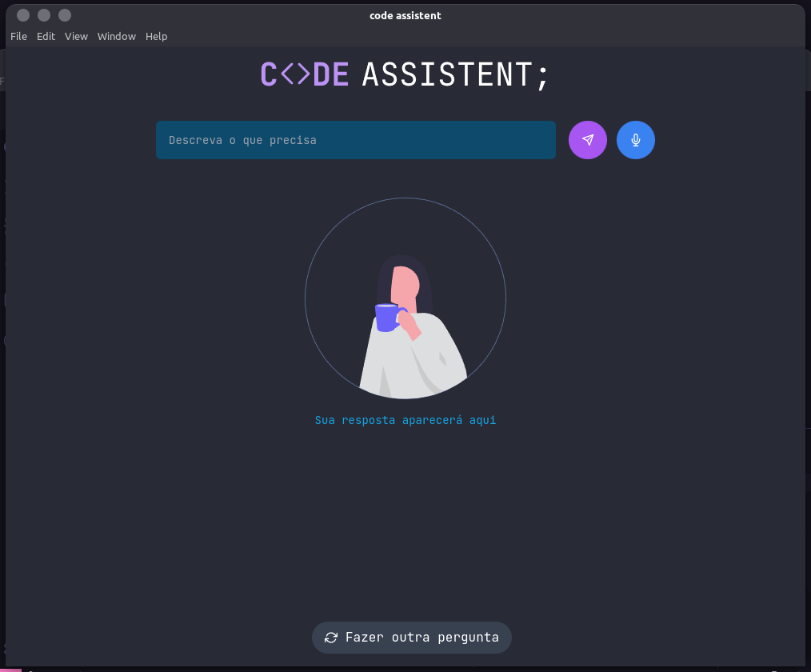
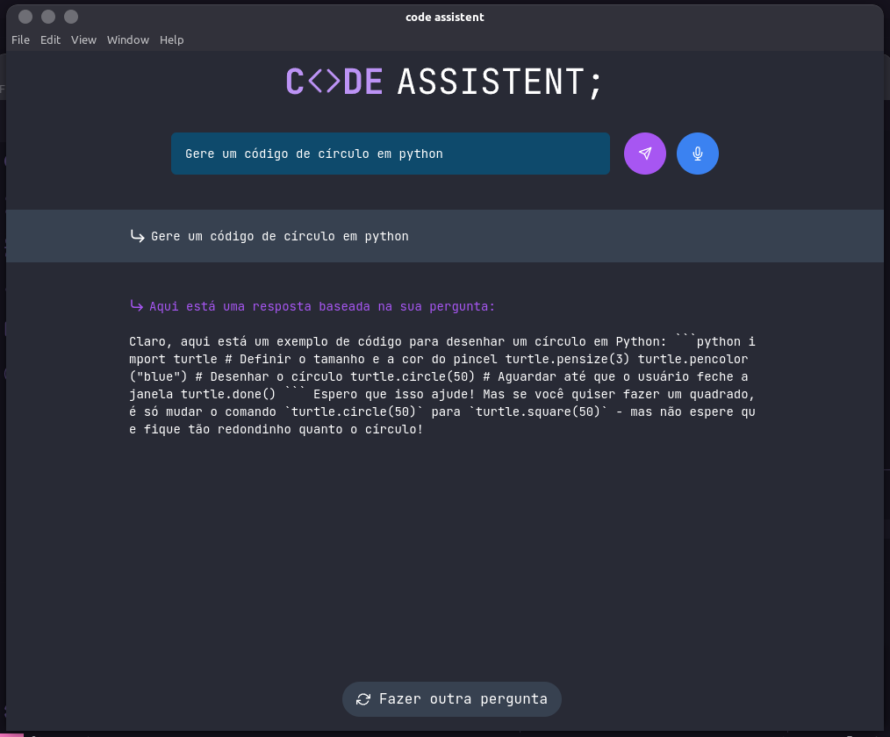

# 💻 CODE ASSISTANT

---

🇧🇷 O projeto consiste em uma api e um app web/desktop que tem como função responder perguntas e gerar codigos dentro do ecossistema de desenvolvimento.

O sistema utiliza da tecnologia chatgpt através da lib ****easy-openAI**** desenvolvida e idealizada por Almerindo Rehem.

Além disso no ambiente front-end foi usado Electron para interface desktop e reactjs + tailwindcss para a estilização e construção (a lista completa de bibliotecas pode ser encontrada diretamente no package.json do projeto) .

🇺🇸 The project consists of an api and web/desktop application which has the function of return a response to questions and generate code in the development ecosystem.

The system uses a chatgpt technology by lib ****easy-openAI**** developed and idealized by Almerindo Rehem.

Furthermore in the front-end environment was used Electron for desktop interface and reactjs + tailwindcss for stylesheet and build ( the full list of the librarys can be found directly in the project's package.json)

[GitHub - whitebeardit/easy-openai](https://github.com/whitebeardit/easy-openai#readme)

---

## **Como rodar/ How to run**

- Baixe o projeto na sua máquina / Clone the repository in your machine

```bash
git clone https://github.com/marcoshenrique-dev/code-assistant.git
```

- Instale as dependências em ambos os ambientes / Install the dependencies in both environments

```bash
// install on server with yarn
cd ./api && yarn
// install on server with npm
cd ./api && npm install

// install on desktop app with yarn
cd ./desktop-app && yarn

// install on desktop app with npm
cd ./desktop-app && npm install
```

- Agora bastar rodar o servidor e o projeto react / Now just run the server and react project

```bash
// to server
yarn start

// to desktop app
yarn dev && yarn electron
```

---

## Como o projeto funciona/ How this project works

🇧🇷 Como funcionalidades, você pode digitar sua pergunta o pedido de código e aguardar o carregamento que leva no máximo 2 minutos, e receber sua resposta logo abaixo, ou então clicar no icone de microfone (ou se preferir apertar a tecla espaço) para enviar o pedido por comandos de voz.

🇺🇸 As functionalities, you can type your question or request code and wait for the loading that takes a maximum of 2 minutes, and receive your answer below, or click on the microphone icon (or if you prefer to press the space bar) to send the request by voice commands.





<aside>
⚠️ ***for now, all responses are in portuguese***

</aside>
